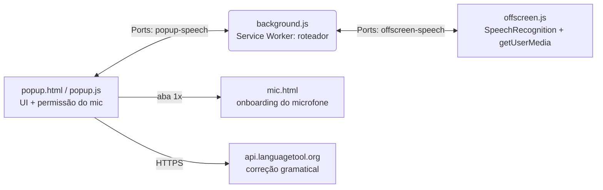

# 🎤 Transcrever Fala

> Transcrição de voz em tempo real **dentro do Chrome**, que continua gravando em **background enquanto você navega** em qualquer site. Fale → copie → cole onde quiser.

[](manifest.json)
[](https://www.google.com/chrome/)
[](https://developer.chrome.com/docs/extensions/mv3/intro/)
[](#-compatibilidade)
[](#-compatibilidade)
[](#-compatibilidade)
[](LICENSE)
[](https://github.com/oviinii/transcribe-extension/pulls)

---

## ✨ Por que essa extensão?

O popup do Chrome **fecha quando você clica fora** — e a maioria das extensões de voz para de gravar junto. Esta aqui não:

- 🎧 **Grava em background** via Offscreen Document — troque de aba, navegue, a transcrição continua
- ⚡ **Tempo real** — texto aparece enquanto você fala (parcial + final)
- 🌍 **4 idiomas** — PT-BR, EN-US, ES-ES, FR-FR
- ✨ **Correção gramatical** — botão Corrigir (vírgulas, pontos, ortografia via LanguageTool + retoque local)
- 🔌 **Auto-reconexão** — se o Chrome suspender o service worker, popup e offscreen reconectam sozinhos
- 🌙 **Modo escuro automático** — segue o tema do sistema
- 🔒 **Sem build, sem dependência** — HTML/CSS/JS puro, Manifest V3

---

## 📸 Visual

> Dica: tire um print do popup gravando e salve como `docs/popup.png` para aparecer aqui.

| Popup (claro) | Popup (gravando) |
|---|---|
| `docs/popup.png` | `docs/popup-recording.png` |

Botão de microfone em gradiente com anel pulsante ao gravar, status em pill (🟡 ouvindo · 🟢 pronto · 🔴 erro), card de transcrição com contador de caracteres e ações **Copiar / Corrigir / Limpar**.

---

## 🚀 Instalação (2 minutos, igual no Windows, Mac e Linux)

1. Baixe ou clone o repositório:
   ```bash
   git clone https://github.com/oviinii/transcribe-extension.git
   ```
2. Abra `chrome://extensions/` no Chrome (versão **116+**)
3. Ative o **Modo do desenvolvedor** (canto superior direito)
4. Clique em **Carregar sem compactação** (*Load unpacked*)
5. Selecione a pasta `transcribe-extension/`
6. Fixe o 📌 ícone da extensão na barra de ferramentas

> Quer a extensão compactada? `chrome://extensions/` → **Empacotar extensão** gera o `.crx` (não suba o `.pem`/`.zip` — já estão no `.gitignore`).

---

## 🎯 Como usar

1. Clique no ícone da extensão
2. Escolha o idioma (padrão **PT-BR**)
3. Clique no **microfone** (*Começar a ouvir*)
   - **Primeira vez:** o Chrome pede o microfone. Se algo estava bloqueado, a extensão **abre sozinha a aba `mic.html`** → clique em **Permitir microfone** → **Permitir** no Chrome → volte ao popup e clique de novo. Só precisa fazer isso **uma vez**.
4. **Pode trocar de aba e navegar** — a gravação continua em background
5. Clique em **⏹ Parar de ouvir** (ou no microfone, ou `Espaço`/`Esc`)
6. Opcional: clique em **✨ Corrigir** para pontuação e gramática
7. Clique em **⧉ Copiar** e cole onde quiser (`Ctrl+V` / `Cmd+V`)

### ⌨️ Atalhos (com o popup aberto)

| Tecla | Ação |
|---|---|
| `Espaço` | Gravar / parar |
| `Esc` | Parar |
| `Ctrl/Cmd + Enter` | Copiar |
| `Ctrl/Cmd + Backspace` | Limpar |

---

## 🏗️ Como funciona (arquitetura)



**Por que Offscreen?** O popup morre ao perder o foco; o Offscreen Document (`USER_MEDIA` + `AUDIO_PLAYBACK`) mantém o `SpeechRecognition` vivo. O service worker só roteia mensagens entre os dois — e se o Chrome suspendê-lo, **ambas as pontas reconectam sozinhas** e ressincronizam o estado.

```
├── manifest.json          # Manifest V3 (Chrome 116+)
├── background.js          # Service Worker: ponte popup ↔ offscreen
├── offscreen.html/js      # SpeechRecognition em background
├── popup.html/js/css      # UI moderna clean + dark mode
└── mic.html/js            # Aba de onboarding p/ liberar o microfone 1x
```

---

## 🔧 Permissões (e por quê)

| Permissão | Para quê |
|---|---|
| `offscreen` | Rodar o reconhecimento em background |
| `clipboardWrite` | Botão Copiar |
| `storage` | Lembra que o mic já foi liberado (+ histórico futuro) |
| `contentSettings` | Tenta reverter bloqueio de mic automaticamente |
| `https://api.languagetool.org/*` | Botão ✨ Corrigir (envia o texto para correção) |

---

## 🔒 Privacidade

- **Voz → texto:** usa a Web Speech API do Chrome (o áudio passa pelos servidores de reconhecimento do Google, como em qualquer site que usa `SpeechRecognition`).
- **Correção:** o texto transcrito é enviado ao **LanguageTool** público somente quando você clica em **Corrigir**. Sem internet, cai para um retoque local simples (maiúsculas + ponto final).
- Nada é enviado para outro lugar; não há analytics nem conta.

---

## 🖥️ Compatibilidade

| SO | Chrome | Status |
|---|---|---|
| Windows 10/11 | 116+ | ✅ |
| macOS 12+ | 116+ | ✅ |
| Linux | 116+ | ✅ |

Requisitos: Chrome 116+ (Offscreen Document), microfone funcional e permissão concedida.

---

## 🐛 Problemas comuns

| Sintoma | Solução |
|---|---|
| "Permissão de microfone negada" | Deixe a extensão abrir a aba `mic.html` → **Permitir microfone** → **Permitir** |
| "Ainda bloqueado" | `chrome://settings/content/microphone` → tire a extensão do **Bloquear** |
| Windows: mic não aparece | Configurações → Privacidade → **Microfone** → permita o Chrome; Sistema → **Som** → confira o dispositivo de entrada |
| Mac: mic não aparece | Ajustes do Sistema → Privacidade e Segurança → **Microfone** → ative o Chrome |
| "Reconectando…" | Normal após suspensão do SW — aguarde ~1s e clique de novo; se persistir, recarregue em `chrome://extensions/` |
| Correção falha | Verifique a internet (LanguageTool) — o retoque local ainda é aplicado |

---

## 🗺️ Roadmap

- [x] Background persistente (offscreen)
- [x] Correção gramatical (LanguageTool + fallback)
- [x] Onboarding de microfone em aba
- [x] Auto-reconexão após suspensão
- [x] Dark mode
- [ ] Inserir texto direto no campo focado da página
- [ ] Histórico de transcrições
- [ ] Exportar `.txt` / `.srt`
- [ ] Publicar na Chrome Web Store

---

## 🤝 Contribuindo

1. Fork o projeto
2. Crie uma branch (`git checkout -b feat/minha-ideia`)
3. Commit (`git commit -m 'feat: minha ideia'`)
4. Push (`git push origin feat/minha-ideia`)
5. Abra um Pull Request — toda ajuda é bem-vinda! 🚀

---

## 📄 Licença

MIT — veja [LICENSE](LICENSE). Feito com 🎤 por [oviinii](https://github.com/oviinii).
